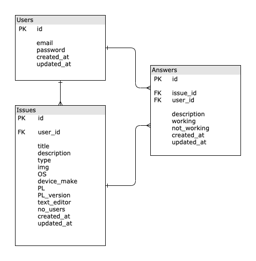

<!-- heading section -->
# Dilma Community

This is a community were any person with issues regarding the techncal or computer field can publish the issue and recive answers for it, or could look for the same issue published by another users.

## My Wbsite Deployment
[Dilma](https://shrouded-savannah-19062.herokuapp.com/)

<!-- unorder list -->
## Technologis Used
   - Ruby on Rails
   - Bootstrap
   - HTML/CSS
## Website ERD, Wireframe and User Stories
<!-- images -->
### ERD

### Wireframe
#### Home Page

#### Logged_in Page

#### Show Page

#### Add issue Page


### User Stories
1.	User without account can only see issues and show any issue.
2.	User can sign in to the site, and must enter the email and password to complete       signing in.
3.	After signing in user can edit its account, or sign out.
4.	User can add a new issue.
5.	When user add new issue, user must enter the title, type and description.
6.	User can onley add solution to an existed issue.
7.	When user add new solution, user must enter the description.
8.	User can add comment to an existed solution by press button worked if the solution    worked or didn't work if the solution did not work
9.	User can delete edit an issue after making it.
10. User can delete edit a solution after making it.
11. User can delete edit a comment after making it.
12. User can see the issues, solutions, comments after making it.

## Four Days Of Coding
### Day One
   - Write and design the wireframe, user story and ERD for the Dilma wep app.
   - Create the model User using devise.
   - Create the model Issue.
 
   
### Day Two
   - Added CRUD for the model Issue. 
   - Create the model Answer.
   - Added CRUD for the model Answer.

### Day Three
   - Designing the Issue views using Bootstrap
   
### Day Four <last day>
   - Designing the user views using Bootstrap
   - Designing the Issue views using Bootstrap
   
<!-- order list -->
<!-- 
1. JS
2. Jquery
3. Html/Css 
-->


<!-- sperator line -->
<!-- --- -->

## Snippet Of The Code
### Back to the previous page
```rb
    <div class="text-center">
   <% if (@back_path == "http://localhost:3000/issues/new" || "http://localhost:3000/issues/:id/edit" )%>
   <strong> <%= link_to "Back", root_path %>  </strong>
    <% else %>
    <strong>  <%= link_to "Back", :back %>  </strong>
    <% end %>
    </div><br>
</div>
```
### Embed html in ruby 
```rb
     <div>
                   <% if(!user_signed_in? || answer.user.id != current_user.id) %>
                    <%= link_to ("<i class='far' style='font-size:25px;color:green'> &#xf582; </i>").html_safe %>
                    <%= link_to ("<i class='far' style='font-size:25px;color:navy'> &#xf5b4; </i>").html_safe %>
                    <% else %>
                    <%= link_to ("<i class='far' style='font-size:22px;color:black'> &#xf044; </i>").html_safe, edit_issue_answer_path(answer.issue_id,answer)%>
                    <%= link_to ("<i class='far' style='font-size:22px;color:darkred'> &#xf2ed; </i>").html_safe, issue_answer_path(answer.issue_id,answer) , method: :delete %>  
                    <% end %>
                    </div>
```

## Challenges 
   - Submitting a review on the published answers.
   - Designing with Bootstrap.

## Features and Improvements to be in Three Mens Morris Game V2 
   - Enable user to bookmark an issue or answer.
   - Enable user to review on an answer.
   - Add a search and filter features.

## Links
   - [Ruby on Rails](https://rubyonrails.org/)
   - [Bootstrap](https://getbootstrap.com/docs/4.4/getting-started/introduction/)
   - [Bootstrap Cheatsheet](https://hackerthemes.com/bootstrap-cheatsheet/#table)