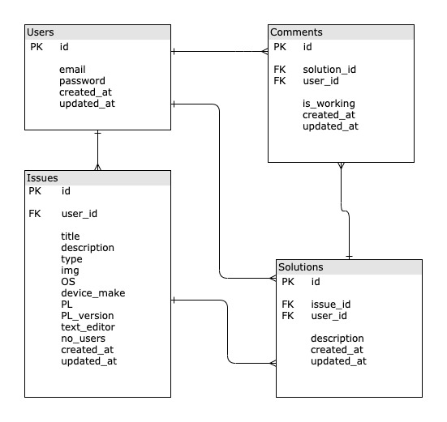
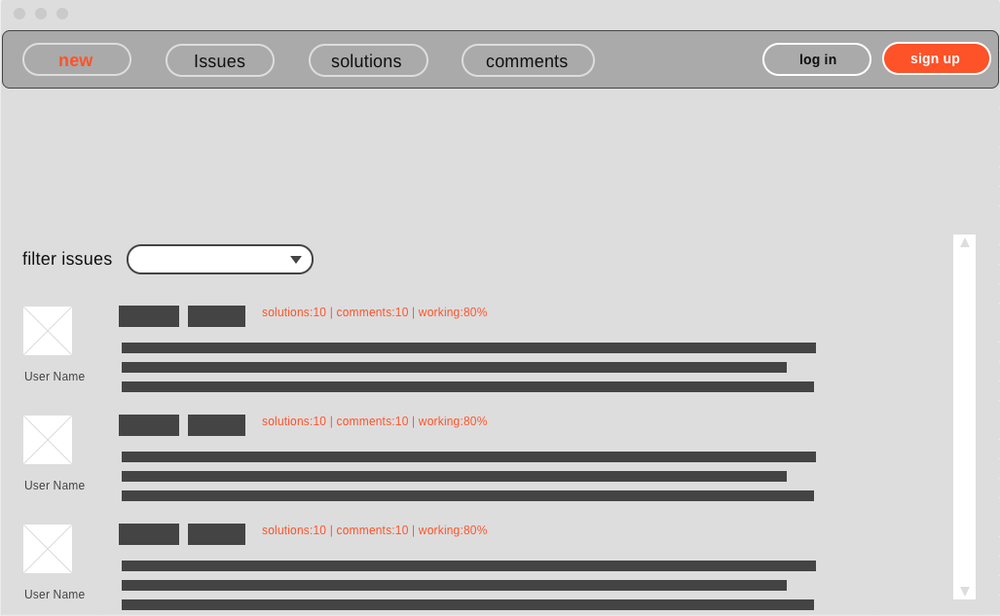
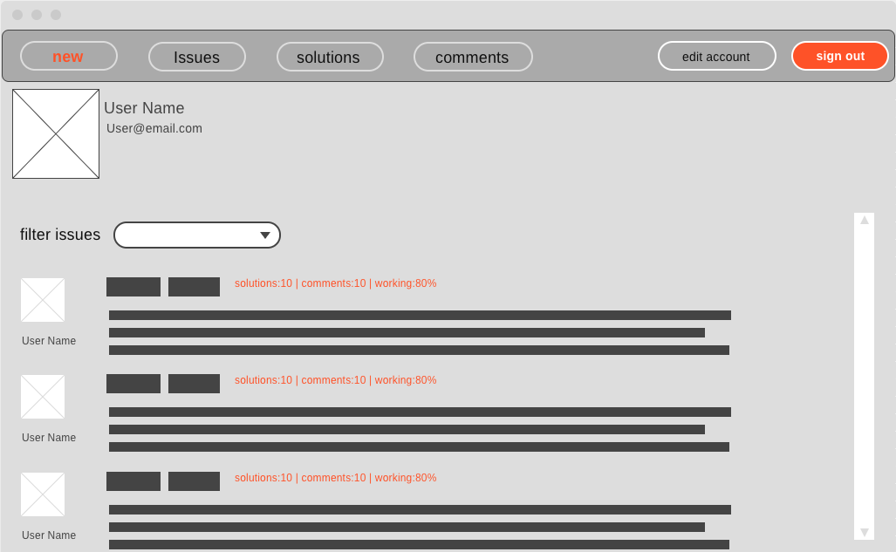
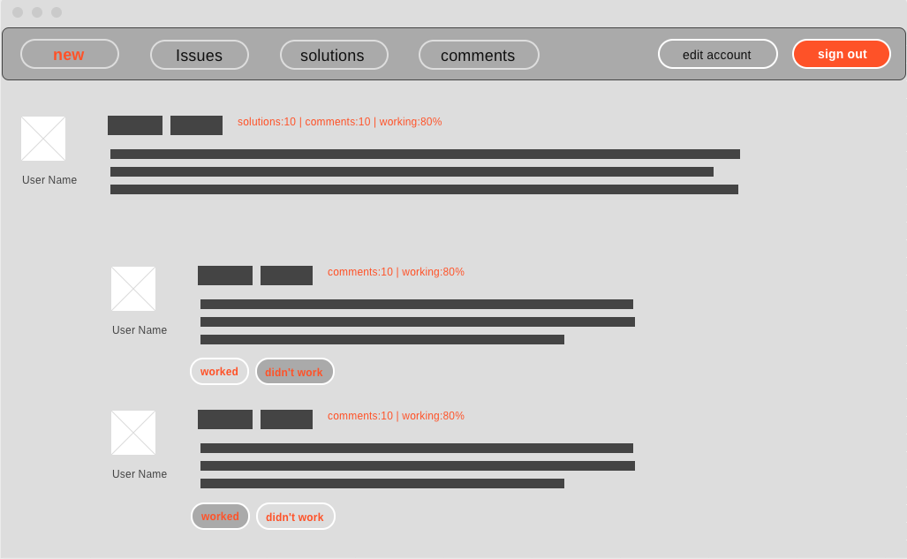
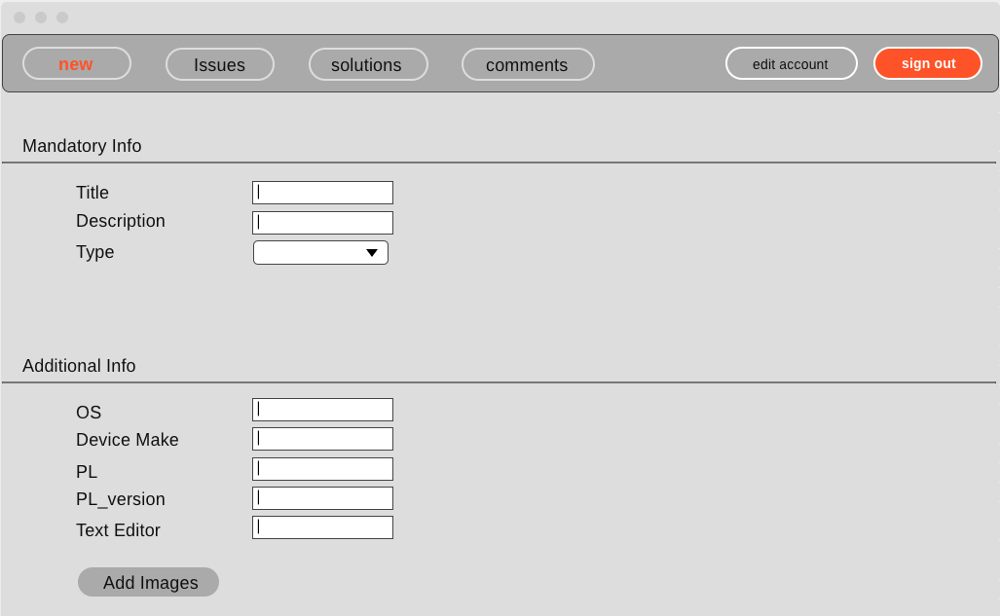

<!-- heading section -->
# IT Issues Solving comunety

This is a two players game that start with each player having 3 stones to place it on the board,
The winner is the first player to align their three pieces on a vertical line or horizontal line.

## My Wbsite Deployment

<!-- unorder list -->
## Technologis Used

## Website ERD, Wireframe and User Stories
<!-- images -->
### ERD

### Wireframe
#### Home Page

#### Logged_in Page

#### Show Page

#### Add issue Page

### User Stories
1.	User without account can only see issues and show any issue.
2.	User can sign in to the site, and must enter the email and password to complete signing in.
3.	After signing in user can edit its account, or sign out.
4.	User can add a new issue.
5.	When user add new issue, user must enter the title, type and description.
6.	User can onley add solution to an existed issue.
7.	When user add new solution, user must enter the description.
8.	User can add comment to an existed solution by press button worked if the solution worked or didn't work if the solution did not work
9.	User can delete edit an issue after making it.
10.	User can delete edit a solution after making it.
11.	User can delete edit a comment after making it.
12.	User can see the issues, solutions, comments after making it.

## Four Days Of Coding
### Day One
   - wireframe
   - user story
   - ERD
### Day Two

### Day Three
   
### Day Four <last day>
   
<!-- order list -->
<!-- 
1. JS
2. Jquery
3. Html/Css 
-->

<!-- sperator line -->
<!-- --- -->

## Snippet Of The Code

## Challenges 

## Features and Improvements to be in Three Mens Morris Game V2 

## Links
<!-- links -->

